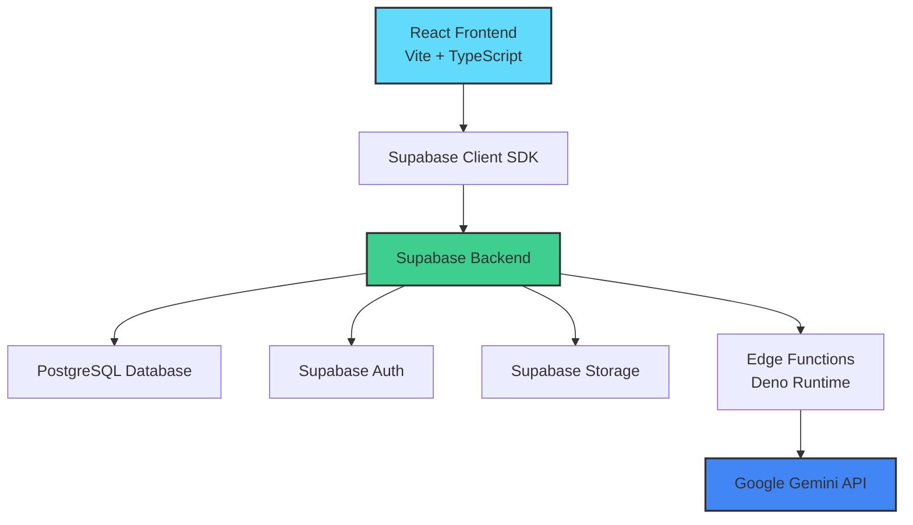

# ApplyFlow

> A modern, AI-enhanced job application tracking platform for software engineers and professionals managing their job search.


[](https://www.typescriptlang.org/)
[](https://reactjs.org/)
[](https://supabase.com/)
[](https://tailwindcss.com/)

---

## Overview

ApplyFlow is a production-ready SaaS MVP that helps job seekers organize their application pipeline, track progress across multiple stages, and leverage AI to improve resumes and follow-up communications. Built with a modern serverless architecture, it provides a clean, responsive interface for managing the entire job search lifecycle.

**Target Users**: Software engineers, product managers, designers, and professionals actively job hunting who need more than a spreadsheet.

**Problem Solved**: Job searching is chaotic. ApplyFlow centralizes application tracking, automates follow-ups, and provides AI-powered insights to help users stay organized and competitive.

---

## Key Features

### Core Functionality
- **Application Management**: Full CRUD operations for job applications with stage tracking (Wishlist → Applied → Interview → Offer → Rejected)
- **Dashboard Analytics**: Real-time metrics including total applications, interview conversion rates, and recent activity
- **Notes & Timeline**: Chronological activity log for each application with custom notes
- **Reminder System**: Set follow-up reminders to stay on top of your pipeline
- **Multi-Currency Support**: Track salaries in 10+ currencies (USD, EUR, GBP, CAD, AUD, SGD, AED, ZMW, TRY, JPY)

### AI-Powered Features
- **Resume Review**: Upload resumes and receive detailed AI feedback including scores, strengths, weaknesses, and actionable improvements (powered by Google Gemini)
- **Follow-Up Email Generator**: AI-generated professional follow-up emails tailored to each application stage

### User Experience
- **Authentication**: Secure email/password authentication with password reset flow via Supabase Auth
- **Resume Storage**: Upload and manage multiple resume versions with cloud storage
- **Responsive Design**: Fully optimized for desktop and mobile experiences

---

## Screenshots

### Dashboard


### Applications List


### Application Details


### Resume Management


---

## System Architecture



### Architecture Layers

**Frontend Layer**
- React components with TypeScript for type safety
- TanStack Query for server state management and caching
- Tailwind CSS + shadcn/ui for consistent design system
- Service layer abstraction (`src/lib/services/`) for clean separation of concerns

**Backend Layer**
- Supabase provides PostgreSQL database, authentication, and file storage
- Row-level security (RLS) policies enforce data access control
- Edge Functions handle AI processing and complex business logic

**AI Layer**
- Supabase Edge Functions isolate AI calls from the frontend
- Google Gemini API processes resume analysis and email generation
- Serverless execution keeps costs low and scales automatically

---

## Data Flow

### Authentication Flow
1. User submits credentials via Login/Register form
2. Supabase Auth validates and issues JWT token
3. Token stored in browser and attached to all subsequent requests
4. RLS policies enforce user-specific data access

### Application CRUD Flow
1. User creates/updates application via form
2. Service layer validates and formats data
3. Supabase client sends request with JWT
4. PostgreSQL executes query with RLS enforcement
5. TanStack Query updates cache and triggers UI refresh

### AI Feature Flow
1. User uploads resume or requests follow-up email
2. Frontend calls Supabase Edge Function with JWT
3. Edge Function authenticates user and retrieves context
4. Edge Function sends prompt to Gemini API
5. AI response processed and returned to frontend
6. Result stored in database and displayed to user

### Resume Upload Flow
1. User selects PDF file via file input
2. File uploaded to Supabase Storage bucket
3. Metadata (filename, size, URL) stored in `resume_versions` table
4. File accessible via signed URL with expiration

---

## Tech Stack

### Frontend
- **React 18**: Component-based UI library
- **Vite**: Fast build tool and dev server
- **TypeScript**: Static typing for improved developer experience
- **Tailwind CSS**: Utility-first CSS framework
- **shadcn/ui**: High-quality, accessible component library
- **TanStack Query**: Server state management with caching and optimistic updates
- **React Router**: Client-side routing

### Backend
- **Supabase**: Open-source Firebase alternative
- **PostgreSQL**: Relational database with full SQL support
- **Supabase Auth**: JWT-based authentication with email/password
- **Supabase Storage**: S3-compatible object storage
- **Edge Functions**: Serverless Deno runtime for backend logic

### AI & External Services
- **Google Gemini API**: Large language model for resume analysis and email generation

### Infrastructure
- **Vercel**: Frontend hosting with automatic deployments
- **Supabase Cloud**: Managed backend infrastructure

---

## Local Setup

### Prerequisites
- Node.js v18 or higher
- npm or bun package manager
- Supabase account (free tier available)
- Google Gemini API key

### Installation

1. **Clone the repository**
   ```bash
   git clone https://github.com/DanielC34/job-app-tracker.git
   cd job-app-tracker
   ```

2. **Install dependencies**
   ```bash
   npm install
   # or
   bun install
   ```

3. **Configure environment variables**
   
   Create a `.env` file in the root directory:
   ```env
   VITE_SUPABASE_URL=your_supabase_project_url
   VITE_SUPABASE_ANON_KEY=your_supabase_anon_key
   ```

   For Edge Functions, configure secrets in Supabase dashboard:
   ```env
   GEMINI_API_KEY=your_gemini_api_key
   ```

4. **Run database migrations**
   ```bash
   # Install Supabase CLI if not already installed
   npm install -g supabase
   
   # Link to your Supabase project
   supabase link --project-ref your-project-ref
   
   # Run migrations
   supabase db push
   ```

5. **Start development server**
   ```bash
   npm run dev
   # or
   bun run dev
   ```

   Application will be available at `http://localhost:5173`

6. **Build for production**
   ```bash
   npm run build
   # or
   bun run build
   ```

---

## Environment Variables

| Variable | Description | Required | Location |
|----------|-------------|----------|----------|
| `VITE_SUPABASE_URL` | Supabase project URL | Yes | Frontend `.env` |
| `VITE_SUPABASE_ANON_KEY` | Supabase anonymous/public key | Yes | Frontend `.env` |
| `GEMINI_API_KEY` | Google Gemini API key for AI features | Yes | Supabase Edge Function secrets |

**Note**: Never commit `.env` files to version control. Use `.env.example` as a template.

---

## Engineering Decisions

### Why Supabase?
Supabase provides a complete backend solution with PostgreSQL, authentication, storage, and serverless functions in one platform. This eliminates the need to manage separate services and reduces infrastructure complexity. Row-level security policies ensure data isolation without custom middleware.

### Why TanStack Query?
TanStack Query (React Query) handles server state management with built-in caching, background refetching, and optimistic updates. This reduces boilerplate code and improves UX by keeping data fresh without manual cache invalidation logic.

### Why Edge Functions for AI?
Isolating AI calls in Edge Functions keeps API keys secure (never exposed to the frontend) and allows for rate limiting, authentication checks, and response processing on the server. The serverless model scales automatically and only charges for actual usage.

### Why Serverless Architecture?
A serverless architecture (Vercel for frontend, Supabase for backend) eliminates server management overhead, scales automatically with traffic, and keeps costs low during development and early growth stages. This is ideal for MVP development and small teams.

---

## Project Structure

```
job-app-tracker/
├── public/                    # Static assets
├── src/
│   ├── components/           # React components
│   │   ├── ui/              # shadcn/ui components
│   │   └── ...              # Feature components
│   ├── contexts/            # React context providers
│   ├── hooks/               # Custom React hooks
│   ├── integrations/        # External service integrations
│   │   └── supabase/       # Supabase client and types
│   ├── lib/
│   │   ├── services/       # Service layer (API abstraction)
│   │   ├── utils/          # Utility functions
│   │   └── types.ts        # TypeScript type definitions
│   ├── pages/              # Page components (routes)
│   └── main.tsx            # Application entry point
├── supabase/
│   ├── functions/          # Edge Functions
│   └── migrations/         # Database migrations
└── ...
```

---

## Future Improvements

### Planned Features
- **Kanban Board**: Drag-and-drop interface for visual pipeline management
- **Email Parsing**: Automatically extract application details from job posting emails
- **Advanced Analytics**: Funnel analysis, time-to-offer metrics, and success rate tracking
- **Interview Scheduling**: Calendar integration for interview management
- **Mobile App**: Native iOS/Android apps using React Native
- **Browser Extension**: One-click application capture from job boards

### Technical Enhancements
- **Improved Mobile Responsiveness**: Enhanced touch interactions and mobile-first layouts
- **Offline Support**: Service worker for offline data access
- **Real-time Collaboration**: Multi-user support for career coaches and mentors
- **Export Functionality**: PDF/CSV export of application data
- **API Rate Limiting**: Enhanced rate limiting for AI features
- **Automated Testing**: Comprehensive E2E and unit test coverage

---

## Contributing

This is a personal project, but feedback and suggestions are welcome. Feel free to open an issue for bugs or feature requests.

---

## License

This project is private and for educational/portfolio purposes.

---

## Contact

**Daniel C**  
GitHub: [@DanielC34](https://github.com/DanielC34)  
Project Link: [https://github.com/DanielC34/job-app-tracker](https://github.com/DanielC34/job-app-tracker)

---

Built with ❤️ by a software engineer, for software engineers.
